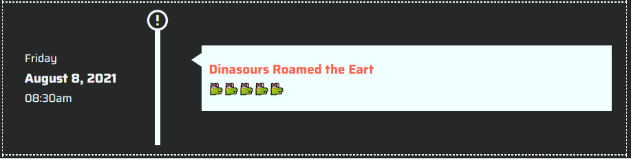

# Component Documentation TimeLine

> This component is used into SICAMEX project

## Usage

First, import the module into your module or where that you want

```ts
import { TimelineModule } from './timeline/timeline.module';

@NgModule({

  imports: [TimelineModule, ... ],
  providers: [],
  bootstrap: [AppComponent],
})
export class AppModule {}
```

#### Default component

```html
<app-timeline [data]="data"> </app-timeline>
```



#### Custom component

```html
<app-timeline
  [leftContainer]="customLeftContainer"
  [rightContainer]="customRightContainer"
  [data]="data"
>
</app-timeline>
<ng-template #customLeftContainer let-leftContent="leftContent">
  <div class="custom-class">
    <span class="tab-button" (click)="login()">{{ leftContent.day }}</span>
    <h3 class="tab-button" (click)="login()">{{ leftContent.date }}</h3>
    <span class="tab-button" (click)="login()">{{ leftContent.right }}</span>
  </div>
</ng-template>

<ng-template #customRightContainer>
  <div class="custom-class">
    <button class="tab-button" (click)="login()">hola mundo</button>
    <button class="tab-button" (click)="signUp()">comida</button>
  </div>
</ng-template>
```


### Props

Props are using in the component.

**Required props are marked with `*`.**

| Name             | Type        | Default | Description                                                                              |
| ---------------- | ----------- | ------- | ---------------------------------------------------------------------------------------- |
| `data`\*         | `TTimeline` | `[]`    | Data using into the component                                                            |
| `leftContainer`  | `HTML`      | `0`     | used to reference so that it is rendered on the left side of the component on side left  |
| `rightContainer` | `HTML`      | `0`     | used to reference so that it is rendered on the left side of the component on side right |

### Author

[@Codevs](www.twitter/codevs_gd)
